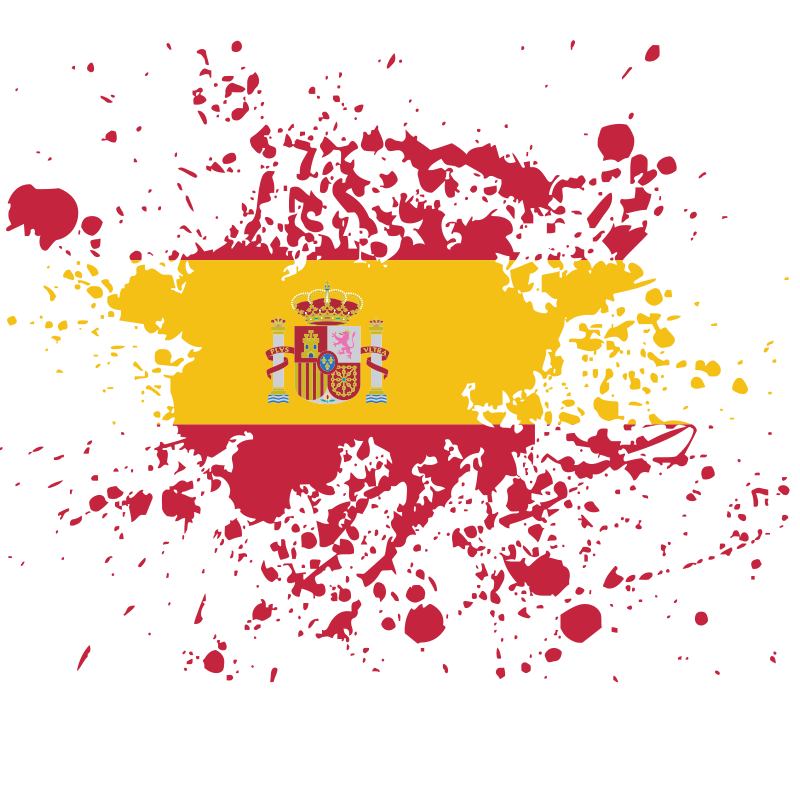
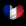
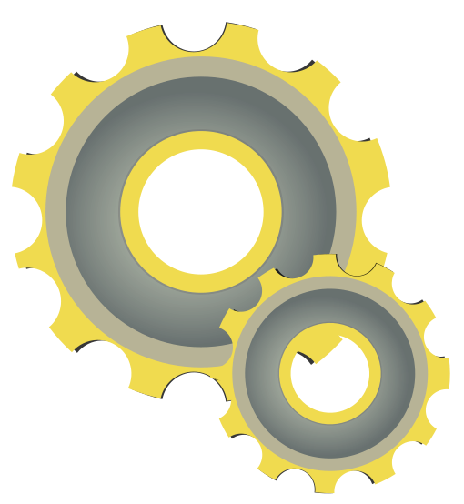

### Hi there 👋

# I'm John Doe

## This is my GitHub training area

### Please don't take it too seriously!

- 🔭 I’m currently working on in an urban garden.
- 🌱 I’m currently learning web development.
- 👯 I’m looking to collaborate on open source projects.
- 🤔 I’m looking for help in understanding this mess of what it is to be human
- 💬 Ask me about gardening and fix old stuff.
- 📫 How to reach me: Try to pronounce my pronouns aloud.
- 😄 Pronouns: Don nadie, Monsieur Tout-le-monde, ein Niemand.
- ⚡ Fun fact: Horses are awesome!

### Languages and Tools:

